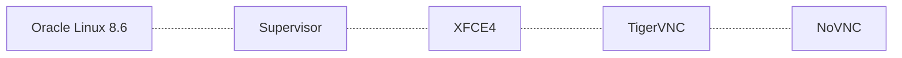

# Linux-Desktop
Another Linux Desktop



### BCI-3 : Build and Tag Image

```sh
docker build --tag linux-desktop:8 .
```


### BCI-4 : Run Docker Image

```sh
docker run -it --rm \
 --shm-size 512m \
 --cap-add=SYS_PTRACE \
 --tmpfs /tmp \
 --tmpfs /run \
 --tmpfs /run/lock \
 --volume /sys/fs/cgroup:/sys/fs/cgroup:ro \
 --volume /lib/modules:/lib/modules:ro \
 --volume /etc/timezone:/etc/timezone:ro \
 --volume /etc/localtime:/etc/localtime:ro \
 -p 80:11 -p 22007:22 -p 59007:5901 \
 --name linux-desktop-8 \
 --hostname linux-desktop-8 \
 linux-desktop:8
```


## Known Issues

### Blurred Text

When using scale on your host system, typically 125% or 150%, the VNC session text looks blurred.

At least in browser there is a workaround - you can zoom out the page with NoVNC session:

* for 125% scaling on host desktop -> set browser zoom to 80%
* for 150% scaling on host desktop -> set browser zoom to 75%


## TimeZone Issues Explained


https://hoa.ro/blog/2020-12-08-draft-docker-time-timezone/


## Install NoVNC 1.3.0

```sh
pip3 install numpy
cd /usr/local
git clone https://github.com/novnc/noVNC.git
cd /usr/local/noVNC
git checkout tags/v1.3.0
cd /usr/local/noVNC/utils
./novnc_proxy --vnc localhost:5901 &
pid=$!
sleep 20
kill ${pid}
```


https://github.com/kasmtech/workspaces-core-images


https://github.com/kasmtech/workspaces-images


https://www.digitalocean.com/community/tutorials/how-to-remotely-access-gui-applications-using-docker-and-caddy-on-debian-9

